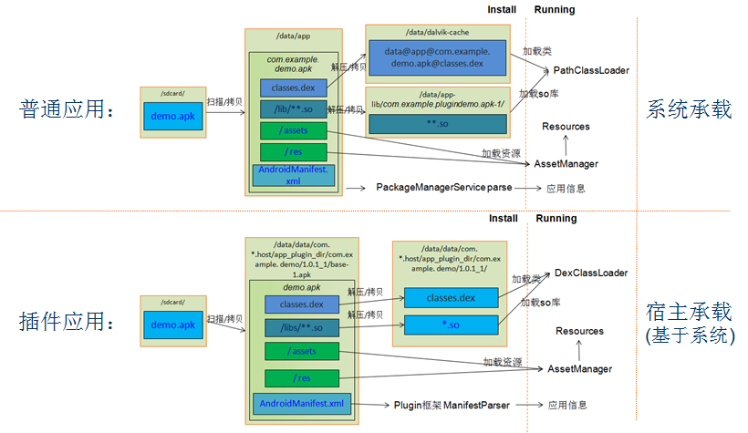
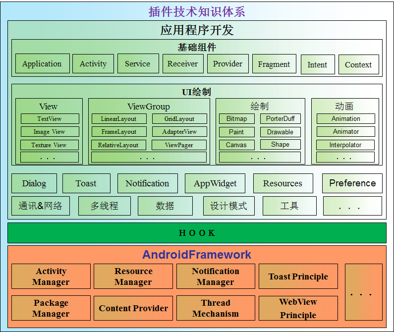
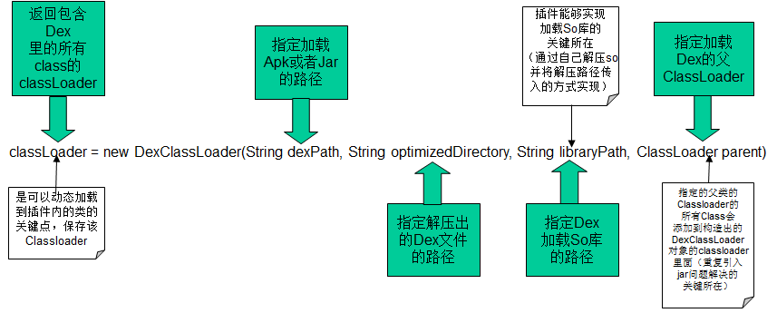
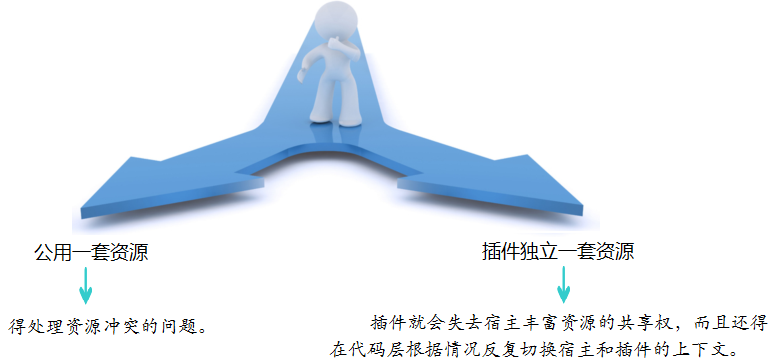
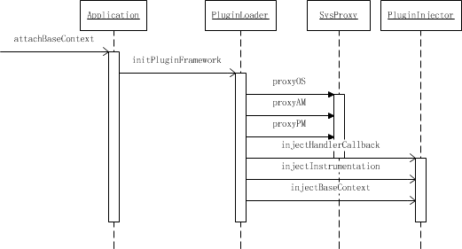
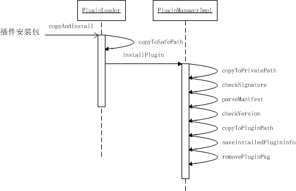
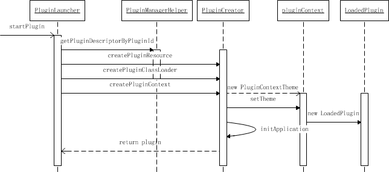
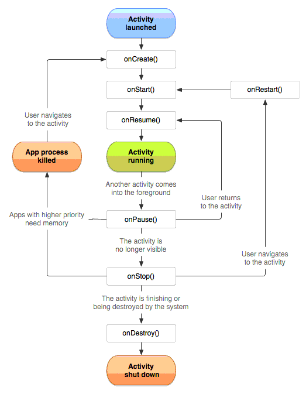
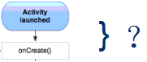
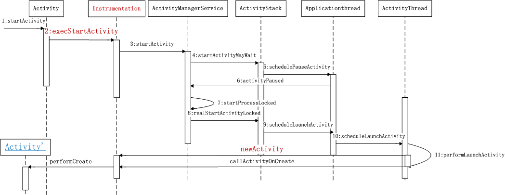

# 插件技术解剖

本文是基于 PACE DM项目组[TwsPluginFramework](https://github.com/rickdynasty/TwsPluginFramework) 框架的开发过程梳理出来的。

**目录**

- [1. 插件技术的重要性](#1-%E7%AE%80%E4%BB%8B)
- [2. 插件技术源于Android OS应用管理](#2)
- [3. 插件技术不同于应用开发](#3)
- [4. 插件技术的核心问题](#4)
  - [4.1 插件信息解析](#41)
  - [4.2 类加载](#42)
  - [4.3 资源加载](#43)
- [5. 解剖TwsPluginFramework框架三个核心流程](#5)
  - [5.1 框架加载](#51)
  - [5.2 安装插件](#52)
  - [5.3 启动插件](#53)
- [6. 插件组件生命周期](#6)
- [7. TwsPluginFramework待完善内容](#7)

## 1. 插件技术的重要性

现今插件技术在各个互联网公司的应用产品上都得到了广泛应用，比如：微信、QQ、淘宝、天猫、空间、携程、大众点评、手机管家等等这些大家在熟悉不过的应用都在使用插件技术 。大到互联网巨头BAT，小到一些输出工具类的团队，都不得不把插件技术牢牢掌握在手里。这一切都是因为插件技术可以给项目开发带来巨大的好处，插件技术所能带来的好处：并行高效开发、模块解耦、解除单个dex函数不能超过65535的限制、动态更新升级、按需加载等。

## 2. 插件技术源于Android OS应用管理



## 3. 插件技术不同于应用开发



## 4. 插件技术的核心问题

### 4.1 插件信息解析
和系统一样，通过解析AndroidManifest.xml来收集应用信息，包括版本、sdk、application、四大组件等等。[然而本应这里配置的权限信息得放到宿主里面提取申请好 ]
### 4.2 类加载
通过DexClassLoader来插件应用的代码，DexClassLoader的使用示意：

在TwsPluginFramework框架中，将插件ClassLoader的parent指定为宿主Host应用的ClassLoader，这样在插件里也能访问宿主的代码。

### 4.3 资源加载
这点和系统一样，也是通过AssetManager的addAssetPath/addAssetPaths方法进行处理的，只是这两个方法是隐藏的，得用通过反射来调用。
我们都知道，通过IDE编译的应用程序，系统会给应用中的每一个资源分配一个id，这个id是用一个八位十六进制的int来表示的，前两位表示package id，后两位表示type id，最后四位表示value id，关于Android系统资源的管理这里不细说，在这我们只关注上层的资源加载重点就行。
在代码层的资源都是通过上下文context的内部成员mResources来获取。对于插件框架来说，如何处理插件资源和宿主资源是一个很纠结的选择：

TwsPluginFramework采用的是公用一套资源，通过修改aapt来完成插件资源package id的指定，从而达到区分资源的目的。

## 5. 解剖TwsPluginFramework框架三个核心流程

### 5.1 框架加载



### 5.2 安装插件



### 5.3 启动插件


## 6. 插件组件生命周期
在Android系统中，组件是有"生命"的。这种生命是系统予的，比如：activity、service、BroadcastReceive、application等，都是系统服务赋予的。而这种赋予是有严格的限制：需要通过在AndroidManifest.xml里面进行配置，在安装的过程中注册到系统里面，如果没在系统里面注册是不允许运行的。

在TwsPluginFramework框架里面，插件的组件拥有真正生命周期，完全交由系统管理、非反射代理。插件应用并没有经过系统安装，也就是说插件应用的组件没有注册到系统里面，TPF是怎么做到让插件里面的组件也能拥有完整生命周期的？这个答案就在TPF里面的两计： 偷梁换柱、瞒天过海。

第一计：偷梁换柱，用我们的专业术语来说就是：（动态）代理。对于Android系统而言，维护组件生命周期的几个重点对象：PMS、AMS、ActivityThread里面的mInstrumentation(Instrumentation)和H的Handler.Callback、Application(ContextWrapper)的mBase(Context)。对的，在TPF框架里面第一件事就是代理掉上面的对象(PMS、AMS是代理在本地的远端代理对象)，以便能更好的在宿主里面运行插件应用组件和加载插件资源。对于PMS和AMS上面已经说了，在宿主的进程空间只能获取到在本地Proxy；Instrumentation也在上面说了，是负责监控应用程序和系统交互的枢纽。在ActivityThread内部对于组件的操作行为以及Intent等相关数据操作都是通过Message封装后有由内部类H的回调Callback来处理的。

第二计：瞒天过海，系统既然要先注册组件，那TPF就在宿主里面注册好一批待用的组件信息，等需要的时候就去早已申明好的集合里面取一个相应的组件去走系统的流程，等在最终创建对象的时候换回来就行了。
这里就以我们最常用的activity为例来细说一下这个过程：
先来看一下activity的生命周期:



这张图，大家在熟悉不过了，可是在onCreate之前系统帮我们做了些什么事，
这个环节是解决插件组件activity完整生命周期的关键。我们来看一下这个过程的流程图：


从开始执行execStartActivity到最终将Activity对象new出来这个过程，系统层会去校验需要启动的activity的合法性[就是是否有在某个应用的AndroidManifest.xml里面注册]以及按启动要求创建activity对象。清晰了这点我们就可以很好的绕过系统的约束，达到我们的目的：【插件中的组件拥有真正生命周期，完全交由系统管理、非反射代理】。
简单来说方案就两步：
Step1、在开始startActivity的时候将需要启动的插件组件替换成宿主预先声明号的。
```java
    public ActivityResult execStartActivity(Context who, IBinder contextThread, IBinder token, Activity target,
    	Intent intent, int requestCode, Bundle options) {

		//如果启动的是插件的activity组件，这里面将会被替换成宿主预先声明的
		PluginIntentResolver.resolveActivity(intent);
		return hackInstrumentation.execStartActivity(who, contextThread, token, target, intent, requestCode,  ptions);
    }
```
Step2、在最终创建activity对象的时候改回成插件组件的。
```java
    @Override
    public Activity newActivity(ClassLoader cl, String className, Intent intent) throws InstantiationException,
            IllegalAccessException, ClassNotFoundException {

        ClassLoader orignalCl = cl;
        String orginalClassName = className;
        String orignalIntent = intent.toString();
        if (ProcessUtil.isPluginProcess()) {
            // 将PluginStubActivity替换成插件中的activity
            if (PluginManagerHelper.isStub(className)) {
                String action = intent.getAction();
                if (action != null && action.contains(PluginIntentResolver.CLASS_SEPARATOR)) {
                    String[] targetClassName = action.split(PluginIntentResolver.CLASS_SEPARATOR);
                    String pluginClassName = targetClassName[0];
                    final String pid = intent.getStringExtra(PluginIntentResolver.INTENT_EXTRA_PID).trim();
                    PluginDescriptor pluginDescriptor = TextUtils.isEmpty(pid) ? PluginManagerHelper.getPluginDescriptorByClassName(pluginClassName) : PluginManagerHelper.getPluginDescriptorByPluginId(pid);
                    Class<?> clazz = PluginLoader.loadPluginClassByName(pluginDescriptor, pluginClassName);
                    if (clazz != null) {
                        className = pluginClassName;
                        cl = clazz.getClassLoader();
                        intent.setExtrasClassLoader(cl);
                        if (targetClassName.length > 1) {
                            // 之前为了传递classNae，intent的action被修改过
                            // 这里再把Action还原到原始的Action
                            intent.setAction(targetClassName[1]);
                        } else {
                            intent.setAction(null);
                        }
                        // 添加一个标记符
                        intent.addCategory(RELAUNCH_FLAG + className);
                    } else {
                        throw new ClassNotFoundException("pluginClassName : " + pluginClassName, new Throwable());
                    }
                } else if (PluginManagerHelper.isExact(className, PluginDescriptor.ACTIVITY)) {
                    // 这个逻辑是为了支持外部app唤起配置了stub_exact的插件Activity
                    PluginDescriptor pluginDescriptor = PluginManagerHelper.getPluginDescriptorByClassName(className);
                    if (pluginDescriptor != null) {
                        boolean isRunning = PluginLauncher.instance().isRunning(pluginDescriptor.getPackageName());
                        if (!isRunning) {
                            return waitForLoading(pluginDescriptor);
                        }
                    }
                    Class<?> clazz = PluginLoader.loadPluginClassByName(pluginDescriptor, className);
                    if (clazz != null) {
                        cl = clazz.getClassLoader();
                    } else {
        throw new ClassNotFoundException("className : " + className, new Throwable());
                    }
                } else {
                    // 进入这个分支可能是因为activity重启了，比如横竖屏切换，由于上面的分支已经把Action还原到原始到Action了
                    // 这里只能通过之前添加的标记符来查找className
                    boolean found = false;
                    Set<String> category = intent.getCategories();
                    if (category != null) {
                        Iterator<String> itr = category.iterator();
                        while (itr.hasNext()) {
                            String cate = itr.next();
                            if (cate.startsWith(RELAUNCH_FLAG)) {
                                className = cate.replace(RELAUNCH_FLAG, "");
                                PluginDescriptor pluginDescriptor = PluginManagerHelper.getPluginDescriptorByClassName(className);
                                if (pluginDescriptor != null) {
                                    boolean isRunning = PluginLauncher.instance().isRunning(
                                            pluginDescriptor.getPackageName());
                                    if (!isRunning) {
                                        return waitForLoading(pluginDescriptor);
                                    }
                                }
                                Class<?> clazz = PluginLoader.loadPluginClassByName(pluginDescriptor, className);
                                cl = clazz.getClassLoader();
                                found = true;
                                break;
                            }
                        }
                    }
                    if (!found) {
                        throw new ClassNotFoundException(
                                "className : " + className + ", intent : " + intent.toString(), new Throwable());
                    }
                }
            } else {
                if (cl instanceof PluginClassLoader) {
                    PluginIntentResolver.resolveActivity(intent);
                } else {
                    // Do Nothing
                }
            }
        }
        try {
            Activity activity = super.newActivity(cl, className, intent);
            if (activity instanceof PluginContainer) {
                ((PluginContainer) activity).setPluginId(intent.getStringExtra(PluginContainer.FRAGMENT_PLUGIN_ID));
            }
            return activity;
        } catch (ClassNotFoundException e) {
            // 收集状态，便于异常分析
            throw new ClassNotFoundException("  orignalCl : " + orignalCl.toString() + ", orginalClassName : "
                    + orginalClassName + ", orignalIntent : " + orignalIntent + ", currentCl : " + cl.toString()
                    + ", currentClassName : " + className + ", currentIntent : " + intent.toString() + ", process : "
                    + ProcessUtil.isPluginProcess() + ", isStubActivity : "
                    + PluginManagerHelper.isStub(orginalClassName) + ", isExact : "
                    + PluginManagerHelper.isExact(orginalClassName, PluginDescriptor.ACTIVITY), e);
        }
}
```

方案确实很简单，不过还有一些收尾工作，就是将创建好的[插件]组件进行一些必要的init操作，比如：在声明周期onCreate之前进行上下文替换等操作，这些都在插件框架提供的PluginInstrumentionWrapper里面进行完成的，看一下代码片段：
```java
    @Override
    public void callActivityOnCreate(Activity activity, Bundle icicle) {
        PluginInjector.injectActivityContext(activity);

        Intent intent = activity.getIntent();

        if (intent != null) {
            intent.setExtrasClassLoader(activity.getClassLoader());
        }
        if (icicle != null) {
            icicle.setClassLoader(activity.getClassLoader());
        }
        if (ProcessUtil.isPluginProcess()) {
            installPluginViewFactory(activity);
            if (activity instanceof WaitForLoadingPluginActivity) {
                // NOTHING
            } else {
            }
            if (activity.isChild()) {
                // 修正TabActivity中的Activity的ContextImpl的packageName
                Context base = activity.getBaseContext();
                while (base instanceof ContextWrapper) {
                    base = ((ContextWrapper) base).getBaseContext();
                }
                if (HackContextImpl.instanceOf(base)) {
                    HackContextImpl impl = new HackContextImpl(base);
                    String packageName = PluginLoader.getApplication().getPackageName();
                    // String packageName1 = activity.getPackageName();
                    impl.setBasePackageName(packageName);
                    impl.setOpPackageName(packageName);
                }
            }
        }
        super.callActivityOnCreate(activity, icicle);
        monitor.onActivityCreate(activity);
    }
```

到这插件activity组件就被顺序的启动起来了，并且是系统在维护具备完整的生命周期。
组件service、Receiver也是一样的，只是这两个组件的拦截点在ActivityThread的Handler成员的回调Callback里面进行的。Application和provider在插件启动的时候进行加载。

## 7. TwsPluginFramework待完善内容

基于TwsPluginFramework框架的插件开发当前已基本对齐原生开发，但还是有一些零碎的点需要特殊处理，比如：

1\. 系统全局服务 — Notification、Toast等不能带插件子的资源id 

2\. WebView加载本地页面之前需要替换全局的Context 

3\. 待发现。

另外现今React Native已经火爆一塌糊涂，后面我们打算在DM里面接入这一套技术，进一步完善。
